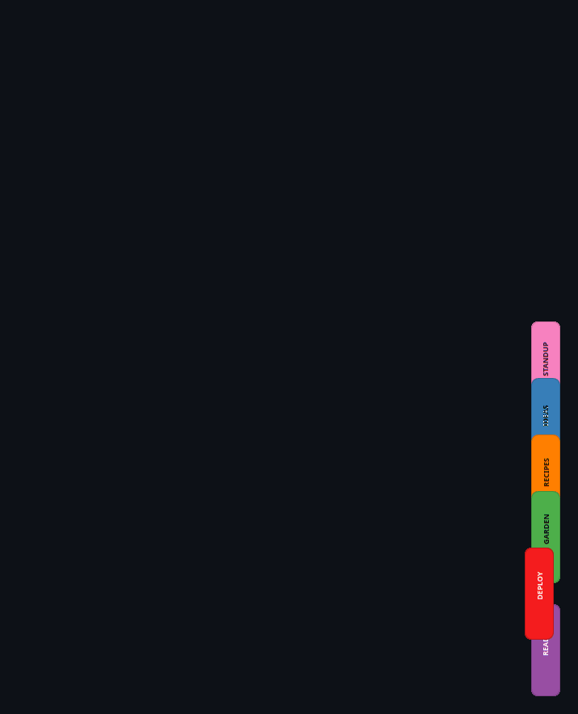
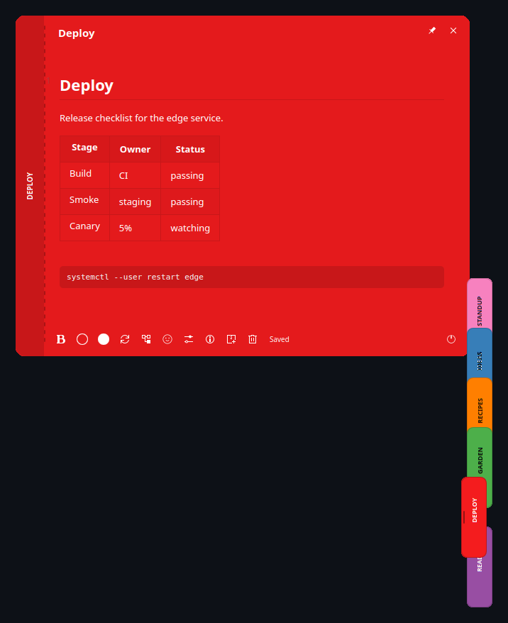
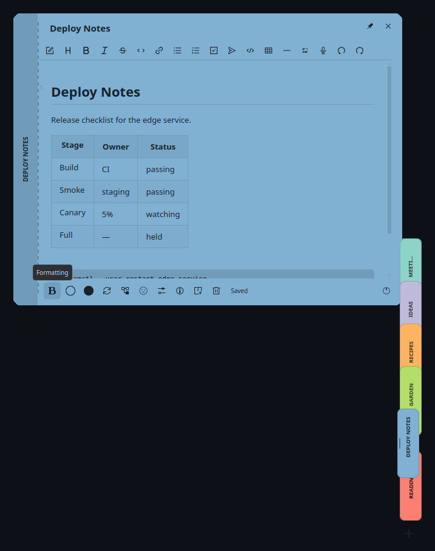
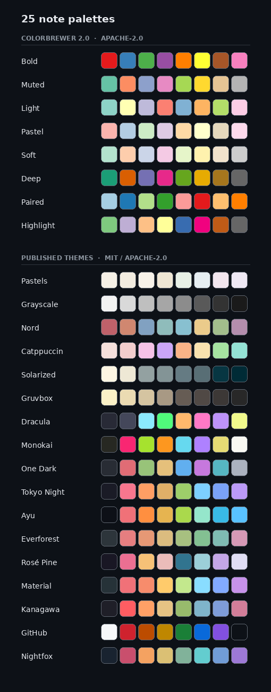
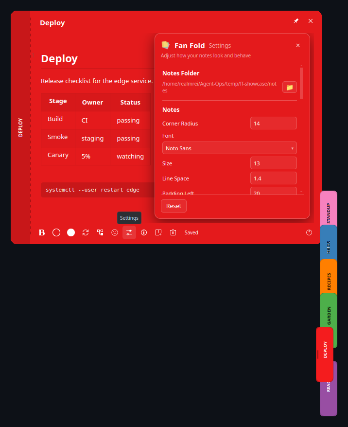

# Fan Fold

**Markdown sticky notes that live at the edge of your screen.** A standalone Qt 6 / KDE
application for Linux — plain `.md` files, a fan of coloured tabs, and a full WYSIWYG editor
one hover away.

<p align="center">
  
</p>

## The idea

Your notes rest as a slim fan of coloured tabs at the screen edge. Hover, and the fan spreads.
Click, and a note opens in a full Markdown editor. Leave, and everything folds back to the edge.

Nothing floats in your way. Nothing lives in a database. The notes are just files.

## Notes are files

Every note is an ordinary Markdown file in a folder you choose. No database, no lock-in —
your notes stay greppable, syncable, and readable by any editor you like. Archive moves a
file to `Archive/`; the Library brings it back.

Point Fan Fold at a folder you already have and it adopts what is there.

<p align="center">
  
</p>

## A real editor

Full WYSIWYG Markdown editing — headings, tables, fenced code with syntax highlighting, task
lists, links, images, even voice memos recorded straight into a note. Autosave runs on a
250 ms quiet period, with crash-recovery journaling and conflict detection if a file changes
underneath you.

The formatting toolbar carries eighteen controls, and it is themed to the note's own paper
colour like everything else:

<p align="center">
  
</p>

## Twenty-five palettes, contrast handled for you

Eight qualitative schemes from ColorBrewer 2.0, plus seventeen published editor and terminal
themes — Nord, Catppuccin, Solarized, Gruvbox, Dracula, Monokai, One Dark, Tokyo Night, Ayu,
Everforest, Rosé Pine, Material, Kanagawa, GitHub, Nightfox — used under their authors'
licences and credited in [`NOTICE`](NOTICE).

Ink auto-derives per swatch against a WCAG AAA (7:1) contrast target: light paper gets
near-black text, dark paper near-white, and the whole card — table borders, code surface,
toolbar glyphs, the tab in the fan — retints together.

Pick any colour. It will read.

<p align="center">
  
</p>

## Settings

Notes folder, corner radius, typography (font, size, line spacing, padding), button size, fan
tab geometry, auto-hide, and per-note icons — all live, all applied the moment you change them.

<p align="center">
  
</p>

## Everything else

- **Auto-hide** — the fan fades away entirely when idle, leaving one small dog-eared mark.
  Hover the mark, or the screen edge, and your notes return.
- **Pinned notes** — float a note in its own always-on-top window, identical styling.
- **Library** — browse every note including `Archive/`; restore with a confirming click.
- **Archive and Trash** — both arm on the first press and act on the second, so a stray
  click never files or deletes a note.
- **System tray** — new note, show the fan, quit; the fan is a dock window, the tray its handle.
- **Per-note icons** — give a note a tab icon from your desktop icon theme, or your own image.
- **Drag to reorder** — rearrange the fan; the order is remembered.
- **Everything themed** — tooltips, scrollbars, tables, panels: no unstyled platform chrome.
- **KDE-native** — Qt 6, KWin dock windows, Plasma virtual-desktop aware, Wayland first.

## Current release: 0.2.0-11

[Download the Debian amd64 package](https://github.com/preyevates/fan-fold/releases/tag/v0.2.0-11).
This release adds folder-scoped fans, whole-library search (Ctrl+F), scrolling for large
fans, per-note typography, safer close/navigation handling, and AppStream metadata with
raster icons for software centres. External changes stop conflicting saves rather than
silently replacing the editor buffer.

### Save and filesystem limits

Normal close and tray quit wait for pending editor changes and refuse to close when the
final Markdown save fails. If recovery itself fails, keep the window open and copy your
edits; in-memory text is not a durable backup.

Atomic saves retain **one prior displaced inode per note**, in the library's hidden
`.fanfold-displaced/` directory on the same filesystem. Changed or ambiguous retained
files stop subsequent saves and are preserved for inspection. This is bounded protection,
not indefinite external-editor compatibility: writes through an old open file descriptor
after its one-generation retention window can no longer be detected or preserved. Keep
that directory with the library; do not treat it as a complete version history.

Asset and icon writes reject symlink substitution and avoid overwriting existing files.
They do not guarantee confinement against another authorized process concurrently moving
an already-open directory outside the library.

## Install

### Debian / Ubuntu (recommended)

Download the latest `.deb` from the
[Releases page](https://github.com/preyevates/fan-fold/releases) and install it with apt,
which pulls the Qt 6 and KDE runtime dependencies for you:

```sh
sudo apt install ./fanfold_*_amd64.deb
```

Then launch **Fan Fold** from your application menu, or run `fanfold`.

### Build from source

```sh
sudo apt install build-essential cmake \
  qt6-base-dev qt6-declarative-dev \
  qml6-module-qtwebengine qml6-module-qtwebchannel \
  qml6-module-org-kde-kirigami qml6-module-org-kde-iconthemes \
  plasma-desktoptheme

cmake -S . -B build -DCMAKE_BUILD_TYPE=Release
cmake --build build -j"$(bash tools/safe-build-jobs.sh)"
sudo cmake --install build
```

QtWebEngine and Kirigami are resolved as QML imports at runtime, so no development
packages are needed for them.

### First run

Fan Fold asks for a notes folder on first launch — pick a new one or an existing folder of
Markdown files. It writes nothing into that folder until you ask it to: `Assets/` appears the
first time you attach an image or icon, `Archive/` the first time you archive a note,
and `.fanfold-displaced/` when saving an existing note.

Settings live in `~/.config/FanFold/`, library state in `~/.local/share/FanFold/`. Your notes
never leave the folder you chose.

**Requirements:** KDE Plasma 6 on Wayland or X11, Qt 6.8 or newer. The published
0.2.0-11 amd64 package is built on Ubuntu 26.04 (resolute); older distributions may
not provide its required library versions. Use `apt` so incompatible dependencies
are reported rather than bypassed.

## How it is built

The document engine (`src/fanfold/`) owns storage, the note catalogue and the file lifecycle,
and knows nothing about the interface. The shell (`src/shell/`) is QML over that engine, with
thin adapters between them; the editor runs in a QtWebEngine view. The engine is covered by
its own test suite — `ctest` in the build directory runs it.

## Credits

The editor is [Vditor](https://github.com/Vanessa219/vditor) by B3log (MIT). Palette values
come from [ColorBrewer 2.0](https://colorbrewer2.org) (Apache-2.0) and from the published
themes listed in [`NOTICE`](NOTICE), each under its own licence. Pastels and Grayscale are
original to this project.

Every screenshot and GIF above is a real capture of the installed application on KDE Plasma 6
Wayland at production geometry — no mockups.

## Licence

MIT — see [`LICENSE`](LICENSE) and [`NOTICE`](NOTICE).
